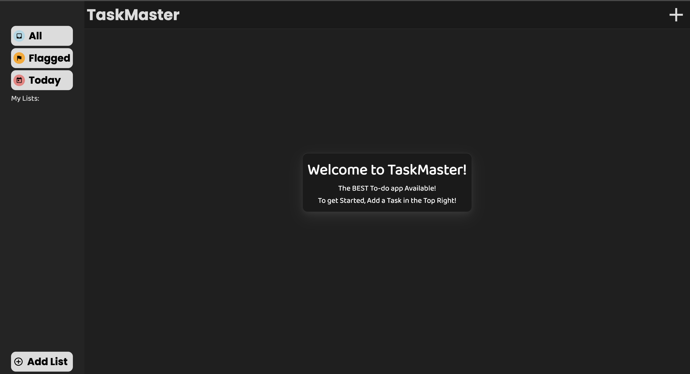
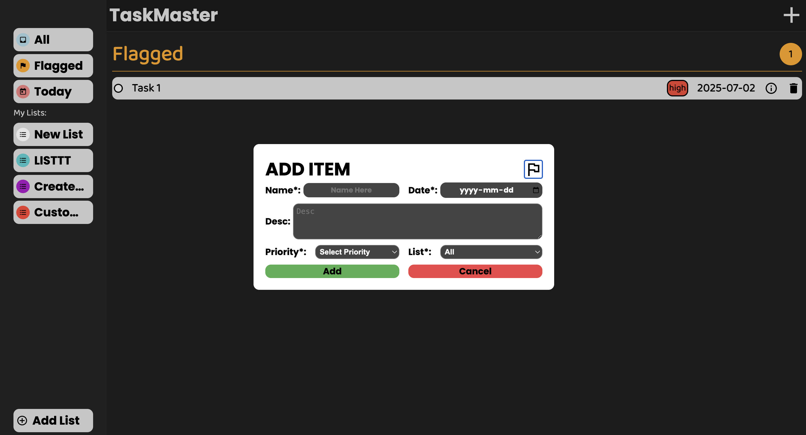
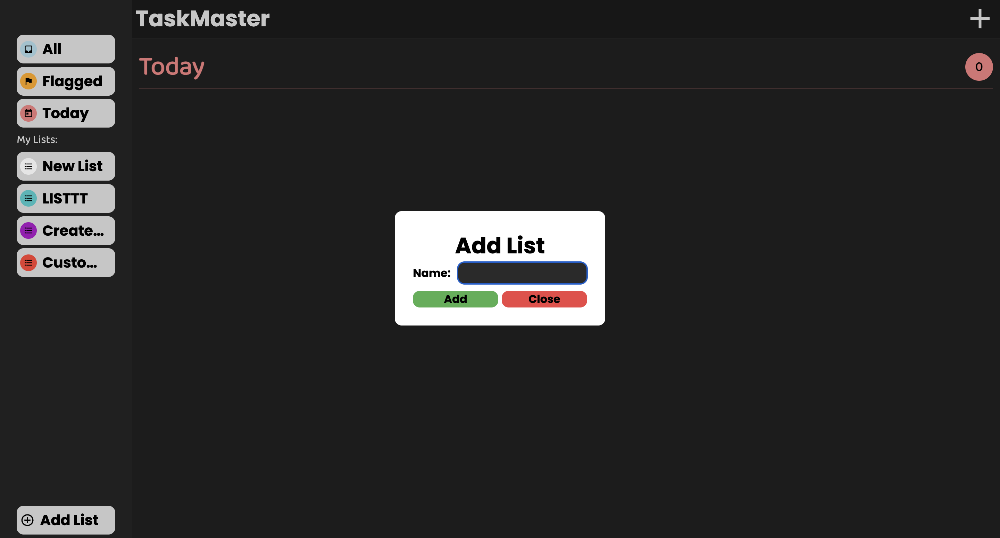
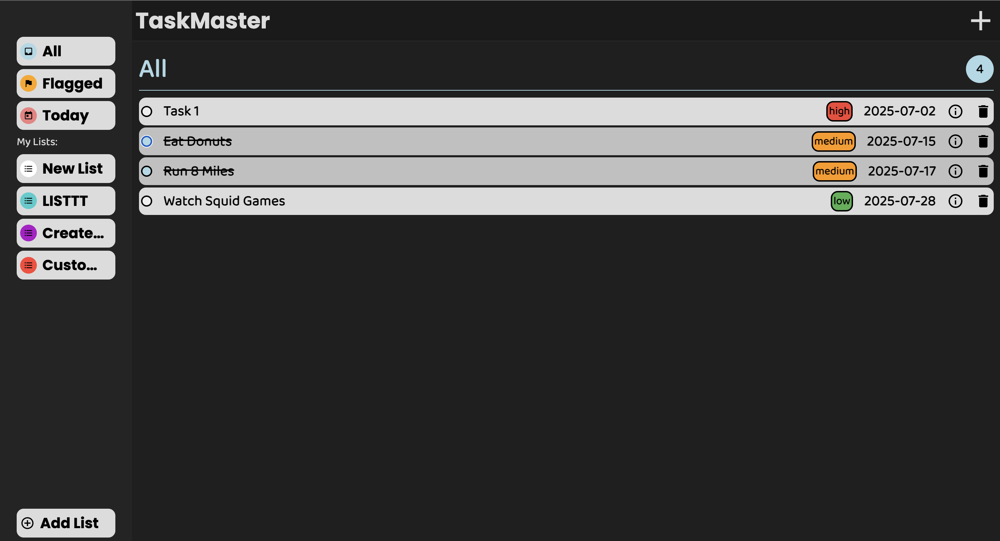

# To do App
This project I focused on making an intuitive to-do app that anyone can use with many features listed below! I focused on learning about modular design and the difficulty that comes with making larger scale projects. I've learnt that planning everything out first is the most effective way to create projects as when I was building i've realized the way I was doing some things wasn't the best available option and with more planning the code could've been cleaner and more readable.

## Features

- Create Lists that store your Todo's
- Add your Todo's to your projects with a bunch of info, great for your future self!
- With localstorage your tasks and projects save! 
- Edit Todo's and change where their located and/or their information
- Delete Unneeded Todo's to clean up your display!
- Click on the Todo's to Complete them! Great Job!
- Clean and Modern UI

[Live Demo](https://raihancarder.github.io/to-do-app/)

## Screenshots

##  Prerequisites

- [Node.js](https://nodejs.org/) (v14 or higher recommended)
- npm (comes with Node)

## Installation

1. Clone the repo  
   `git clone https://github.com/raihanCarder/to-do-app.git`

2. Navigate to the folder  
   `cd to-do-app`

3. Install Dependencies with `npm install` in terminal.

4. Build Project with `npm run build` in terminal. 

5. Open dist/index.html in browser or preview with VS Live Server.

## Tech Stack
- Javascript
- HTML
- CSS
- Webpack

Created by Raihan Carder(https://github.com/raihanCarder)  
Feel free to reach out!

